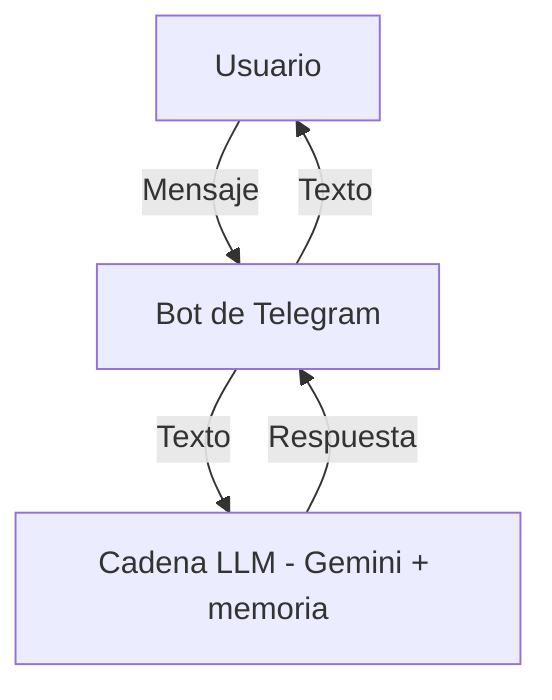

# Asistente virtual para reservas en Telegram
Este script crea un bot de Telegram que actúa como asistente virtual de una peluquería. Usa un modelo de lenguaje Gemini para responder a los mensajes de los usuarios.

##  Funcionalidad
/start: Saludo inicial.

Mensajes de texto: Se envían al modelo para generar una respuesta personalizada.

El modelo usa un prompt y memoria de conversación para mantener contexto.

##  Componentes clave
telegram.ext: Manejo del bot.

LLMChain: Encadena modelo, prompt y memoria.

ChatGoogleGenerativeAI: LLM usado.

ConversationBufferMemory: Guarda historial de conversación.

##  Diagrama del bot

